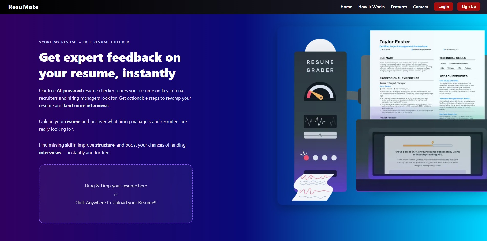

# 🎯 ResuMate — AI-Powered Resume Analyzer 🚀

ResuMate is your personal AI assistant that reviews resumes like a seasoned recruiter. Powered by advanced NLP models and machine learning, it evaluates resume structure, clarity, and alignment to job roles — giving instant feedback, improvement suggestions, and scoring to boost your interview chances!



---

## 📌 Key Features

- ✅ **Resume Upload (PDF/DOCX)** — with drag & drop
- 🤖 **AI-powered Scoring** — based on industry standards
- 📊 **Smart Feedback** — insights on name, structure, skills, length, GitHub, education, and more
- 🎯 **Role Alignment Check** — using BERT's zero-shot classification
- 🧠 **NLP-Powered Parsing** — entity extraction (name, contact, email) + skill detection
- ✨ **Real-time UI Feedback** — sleek, animated UI with a detailed feedback card
- 🔐 **User Auth System** — login, signup, JWT-secured API calls

---

## 🧠 Tech Stack

| Frontend | Backend | AI / ML | Misc |
|----------|---------|---------|------|
| React (Vite) | Django REST Framework | Hugging Face Pipelines | JWT Auth |
| Tailwind CSS | SimpleJWT | BERT / XLM-RoBERTa | Responsive UI |
| React Router | SQLite | Regex + Transformers | Netlify-ready |

---

## 📂 Project Structure

```
ResuMate/
├── frontend/ # React + Vite app
│ ├── src/
│ ├── assets/
│ └── ResumeUpload.jsx, ResumeHero.jsx, AuthModal.jsx ...
├── backend/ # Django app
│ ├── backend/
│ └── Resumate/
│ └── resume_parser.py (NER + BERT classifier)
├── .env
├── requirements.txt
└── README.md
```


---

## 🚀 Getting Started

### ⚙️ 1. Clone the Repo

```bash
git clone https://github.com/your-username/resumate.git
cd resumate
```

### 2. Backend Setup (Django) 

```bash
cd backend
python -m venv venv
source venv/bin/activate  # or venv\Scripts\activate on Windows

pip install -r requirements.txt
python manage.py migrate
python manage.py runserver
```
### (Important!) ✅ Configure .env in backend/ with your HuggingFace API token:

```bash
HF_API_TOKEN=your_huggingface_key
```

### ⚛️ 3. Frontend Setup (React + Vite)

```bash
cd frontend
npm install
npm run dev
```

### 4. 🧪 AI Models Used

- 🤖 Jean-Baptiste/roberta-large-ner-english — for name/entity extraction

- 🧠 joeddav/xlm-roberta-large-xnli — for role alignment via zero-shot classification

- 💬 Regex & NLP — for email, phone, GitHub/LinkedIn, skill & word count

### Contributions are welcome!

- Just fork the repo, make your changes!
Feel free to report issues or request features.

## 👨‍💻 Author

**Akash Krishnan M**  
Personal Project, A Data Science & AI student passionate about AI, Hybrid Models & more about how ML models work..